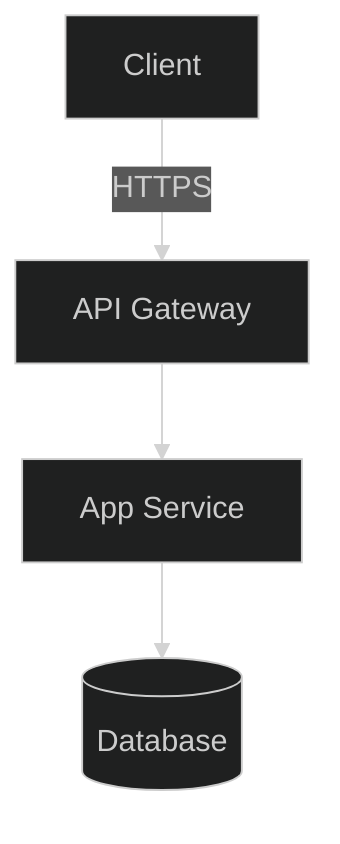

# AI-Assisted Coding Framework

A comprehensive workflow framework that enhances GitHub Copilot with persistent memory, 
documentation RAG, and advanced AI agent capabilities for software development projects.

## 🚀 Overview

This framework integrates the following MCP server to build a powerful spec driven development framework:

- **Context7 MCP**: Provides live documentation and code snippet retrieval for authoritative 
technical references

Together, with the provided prompts, and instructions, this system creates a powerful and customizable development framework.

## 📋 Prerequisites

- **Node.js 16+** (for Context7 MCP server) - Optionally use the remote server instead
- **VS Code** with GitHub Copilot extension
- **Git** for version control

## 🛠️ Installation & Setup

### Step 1: Clone and Copy Framework Files

```powershell
# Clone this repository
git clone https://github.com/ChrisMcKee1/AI-Assisted-Coding.git
cd AI-Assisted-Coding

# Copy all framework files to your project's root directory
# Replace 'your-project-path' with the actual path to your project
Copy-Item -Path ".\*" -Destination "C:\path\to\your-project\" -Recurse -Force
```

### Step 2: Open Project in VS Code

```powershell
# Open your project in VS Code
code .
```
### Step 3:
    If you're creating a new project, go to step 3a
    Otherwise, go to step 3b
### Step 3a: 

Run the command `/plan-product` in GitHub Copilot Agent mode with a short description of your project

### Step 3b:

Run the command `/analyze-product Please setup the Nous dev framework for my workspace` in GitHub Copilot Agent mode.

### Step 4: Verify Completion

1. Verify a new folder `.docs` has been created, and it should contain the definitions for your project
2. The framework will automatically generate the `copilot-instructions.md` file

### Step 5: Start Coding!

Using the core workflow commands below, start your coding! We recommend starting with an ArchReview 
to analyze the project first, and get the AI's recommendations for next steps.

## 🎯 Available Commands

The framework provides several specialized commands that you can use with GitHub Copilot. Simply 
type these commands in chat or comments to trigger specific workflows:

### Core Workflow Prompts

| Prompt             | Purpose                                           | What It Does                                                                                            |
|--------------------|---------------------------------------------------|---------------------------------------------------------------------------------------------------------|
| `/create-spec`     | **Create a Specification**                        | Uses AI to create a specification from your prompt                                                      |
| `/execute-tasks`   | **Start implementing the tasks in the spec list** | Begins the workflow to implement the open tasks in the provided spec folder (or latest if not provided) |
| `/plan-product`    | **Creates a new project in the workspace**        | Creates a new project in your workspace using the provided prompt                                       |
| `/analyze-product` | **Analyze and prep a workspace**                  | Analyzes the workspace and ensures that the workflow is setup properly                                  |


## 🔄 Workflow Examples

### Starting a New Feature

```
/create-spec Add user authentication with OAuth
```

**Expected Flow:**
1. Retrieves current project context and architecture
2. Researches authentication best practices
3. Drafts implementation plan with security considerations
4. Logs decision and creates TODO progress entries
5. Task list, specification, and details all created in the `.docs/specs` folder for the feature

### Implementing Code

```
/execute-tasks Start the `user-auth-feature`
```

**Expected Flow:**
1. Confirms project context and requirements
2. Generates component code with tests
3. Validates against coding standards
4. Updates progress tracking
5. Creates/updates architectural diagrams
6. Commits changes with descriptive messages

## 🚀 Advanced Workflow Example

### Complete Feature Implementation with Requirements Document

For complex features, create a detailed requirements document first, then reference it throughout 
the workflow:

#### Step 1: Create Requirements Document

Create a file like `.docs/requirements/user-notifications.md`:

```markdown
# User Notifications Feature Requirements

## Overview
Implement a real-time notification system for users to receive updates about project activities,
 task assignments, and mentions.

## Functional Requirements
- **Real-time Delivery**: Notifications appear instantly using WebSocket connections
- **Multiple Types**: Support for task assignments, mentions, project updates, and deadlines
- **User Preferences**: Allow users to configure notification types and delivery methods
- **Mark as Read**: Users can mark individual or bulk notifications as read
- **Persistence**: Store notifications in database for offline access

## Technical Requirements
- **Database Schema**: New notifications table with user_id, type, message, read_status, created_at
- **WebSocket Integration**: Extend existing Socket.io implementation
- **API Endpoints**: CRUD operations for notifications and user preferences
- **Frontend Components**: Notification bell icon, dropdown list, settings panel
- **Real-time Updates**: Live notification count and instant message delivery

## Acceptance Criteria
- [ ] Users receive notifications within 2 seconds of triggering event
- [ ] Notification preferences save correctly and persist across sessions
- [ ] Unread count displays accurately in navigation
- [ ] Notifications load quickly (< 500ms) when dropdown opens
- [ ] All notification types work correctly (assignments, mentions, deadlines)
- [ ] Mobile responsive design matches existing UI patterns

## Dependencies
- Existing Socket.io setup
- User authentication system
- Database migration capabilities
- Notification icon assets
```

#### Step 2: Execute Plan → Research → Act Workflow

**Start with Planning:**
```
/create-spec Implement user notifications feature based on requirements in 
`.docs/requirements/user-notifications.md`
```

**Expected Planning Flow:**
1. AI reads and analyzes the requirements document
2. Reviews current project architecture
3. Identifies database schema changes needed
4. Plans API endpoints and frontend components
5. Creates implementation roadmap with phases

**Implementation Phase:**
```
/execute-tasks Implement `user-notifications` spec
```

### Benefits of This Approach

**Comprehensive Context**: The requirements document provides complete context that persists 
across sessions

**Structured Implementation**: Breaking complex features into planned phases ensures systematic 
development

**Progress Tracking**: ConPort memory tracks each phase completion and links decisions to 
requirements

**Quality Assurance**: Acceptance criteria guide testing and validation steps

**Knowledge Retention**: All research findings and implementation decisions are preserved for 
future reference

**Team Collaboration**: Requirements document serves as communication tool between team members

## 🧠 Memory & Context Features

### Persistent Memory
- **Decision Tracking**: All architectural and implementation decisions are logged with rationale
- **Progress Monitoring**: Track feature development from TODO → IN_PROGRESS → DONE
- **Pattern Recognition**: Identify and reuse successful patterns across the project
- **Knowledge Graph**: Link related concepts, decisions, and implementations

### Intelligent Context
- **Active Context**: Maintains current focus and recent changes
- **Product Context**: Stores high-level project information and goals
- **Historical Learning**: Applies lessons learned from past development cycles
- **Cross-Session Memory**: Remembers context between VS Code sessions

### Architecture Documentation & Diagrams

The framework automatically generates and maintains visual architecture documentation using Mermaid 
diagrams stored in the `architectureDiagrams/` folder.

#### ArchReview Command
The `ArchReview` command performs comprehensive analysis of your system architecture:

- **Current State Analysis**: Evaluates existing code structure against documented architecture
- **Scalability Assessment**: Identifies potential bottlenecks for data volume, traffic, and 
fault-tolerance
- **Completeness Check**: Detects missing diagram types and architectural components
- **Gap Identification**: Compares implementation progress with architectural decisions
- **Recommendation Generation**: Provides actionable suggestions for architectural improvements

#### Auto-Generated Diagram Types

The framework creates and maintains multiple diagram types in `architectureDiagrams/`:

**System Overview** (`system_overview.md`)


**Sequence Diagrams** - Show interaction flows between components
**State Diagrams** - Document component states and transitions
**Data Flow Diagrams** - Illustrate information movement through the system
**Infrastructure Diagrams** - Map deployment and hosting architecture
**UML Class Diagrams** - Detail object relationships and inheritance

#### Diagram Management

**Automatic Creation**: Diagrams are generated during `ArchUpdate` commands based on:
- Code analysis and structure detection
- Architectural decisions logged in ConPort
- Implementation progress and patterns
- System complexity and component relationships

**Manual Editing**: You can manually edit any diagram files to:
- Refine architectural representation
- Add business logic documentation
- Include deployment specifications
- Clarify component relationships

**AI Reference**: The AI continuously references these diagrams to:
- Maintain architectural consistency during implementation
- Validate new features against existing design
- Suggest improvements based on current structure
- Ensure code changes align with documented architecture

#### Workflow Integration

```
ArchReview
```
**Generates comprehensive analysis report with recommendations**

```
ArchUpdate: Implement database optimization patterns
```
**Creates/updates relevant diagrams based on the changes**

The AI uses these visual representations as a "source of truth" for architectural understanding, 
ensuring that all code generation and modifications remain consistent with your intended system 
design. Regular review and updates of these diagrams help maintain architectural integrity 
throughout the development lifecycle.

### 📏 Custom AI Guidance: Instructions and Prompts

To further tailor the AI's behavior and provide reusable patterns for common tasks, the framework 
includes specialized folders within the `.github` directory: `.github/instructions` and 
`.github/prompts`. These files are written in Markdown and are designed to be easily customized by 
developers.

#### Instructions (`.github/instructions/`)

This directory contains a collection of instruction files that provide generic "rules" and best 
practices for the AI to follow when working with specific frameworks, languages, or scenarios. They 
help ensure consistency and adherence to established guidelines.

**Purpose:**
- Define coding standards for different technologies.
- Outline best practices for specific development tasks (e.g., performance optimization, security).
- Guide the AI on how to approach problems within a particular framework.

**Available Instruction Files:**
- `aspire.instructions.md`: Guidelines for working with .NET Aspire.
- `blazor.instructions.md`: Best practices for Blazor development with .NET 9.
- `csharp.instructions.md`: C# specific coding conventions and rules.
- `docker.instructions.md`: Instructions for creating and managing Dockerfiles and Docker images.
- `python.instructions.md`: Python specific coding conventions and best practices.
- `react.instructions.md`: Best practices for React development.
- `typescript.instructions.md`: TypeScript specific coding conventions and best practices.

These files serve as excellent starting points and can be expanded or modified to fit your project's 
specific needs and conventions.

#### Prompts (`.github/prompts/`)

This directory houses prompt files that contain detailed, step-by-step instructions for the AI on 
how to perform a specific task in a structured manner. They act as templates for complex operations, 
ensuring the AI asks the right questions and follows a consistent workflow.

**Purpose:**
- Expand simple user requests into a series of actionable steps for the AI.
- Guide the AI through complex code generation tasks (e.g., creating a new component).
- Ensure all necessary information is gathered before the AI proceeds with a task.

**Available Prompt Files:**
- `blazor-component.prompt.md`: A detailed prompt for generating new Blazor components, including 
requirements gathering, best practice adherence, and testing suggestions.

Developers can customize these prompts or create new ones to automate repetitive tasks or to ensure 
a standardized approach to common development activities.

These instruction and prompt files are powerful tools for shaping the AI's behavior, improving the 
quality of its output, and streamlining your development process.

## 📁 Framework Files

### Generated Directories
- **`.docs/`**: Auto-generated for system documentation

### Generated Files
- **`copilot-instructions.md`**: Main configuration file with configurable workflow and AI agent instructions
- **`*.instructions.md`**: Evolving coding standards and best practices

## 🎨 Customization

### Modifying Workflows
Edit `copilot-instructions.md` to customize:
- Workflow sequences and priorities
- Tool ordering and fallback strategies
- Memory synchronization patterns
- Performance optimization settings

Edit `*.instructions.md` files to customize:
- Workflow steps
- Language patterns and standards
- Code generation preferences

### Adding Custom Commands
Add new commands to the `prompts` folder in `.github` folder. Use one of the existing files as a template

Then define the workflow in the `instructions` folder using a .instructions.md file.

### Project-Specific Settings
Update markdown files generated in the .docs folder with your project's:
- Technology stack and architecture
- Coding standards and conventions
- Deployment and infrastructure details
- Team structure and development process

## 🔧 Troubleshooting

### VS Code Integration Issues
1. Restart VS Code after copying framework files
2. Ensure GitHub Copilot extension is active
3. Check that `copilot-instructions.md` is in the root directory
4. Verify the file starts with the correct YAML front matter

## 📈 Performance Tips

- **Use Specific Commands**: More specific commands yield better results
- **Review Status Regularly**: Use `Status` command to maintain project awareness
- **Update Rules Frequently**: Run `RulesUpdate` after completing features
- **Maintain Architecture**: Use `ArchReview` periodically for system health checks

## 🤝 Contributing

1. Fork this repository
2. Create a feature branch
3. Test your changes with a sample project
4. Submit a pull request with detailed description

## 📝 License

This framework is open source and available under the [MIT License](LICENSE).

## 🆘 Support

For issues, questions, or feature requests:
1. Check the troubleshooting section above
2. Review the `copilot-instructions.md` for configuration details
3. Open an issue on the GitHub repository
4. Join our community discussions

---

**Happy Coding with Enhanced AI! 🚀**
