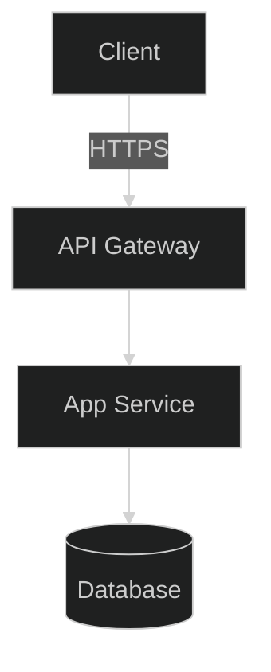

# AI-Assisted Coding Framework

A comprehensive workflow framework that enhances GitHub Copilot with persistent memory, documentation RAG, and advanced AI agent capabilities for software development projects.

## 🚀 Overview

This framework integrates two powerful MCP (Model Context Protocol) servers to supercharge your development workflow:

- **Context7 MCP**: Provides live documentation and code snippet retrieval for authoritative technical references
- **ConPort MCP**: Delivers persistent project memory, decision tracking, and knowledge graph capabilities

Together, they transform GitHub Copilot into an intelligent development assistant that remembers project context, tracks architectural decisions, and maintains comprehensive project knowledge across sessions.

## 📋 Prerequisites

- **Python 3.8+** (required for ConPort MCP server)
- **Node.js 16+** (for Context7 MCP server)
- **VS Code** with GitHub Copilot extension
- **Git** for version control

## 🛠️ Installation & Setup

### Step 1: Clone and Copy Framework Files

```powershell
# Clone this repository
git clone https://github.com/seiggy/AI-Assisted-Coding.git
cd AI-Assisted-Coding

# Copy all framework files to your project's root directory
# Replace 'your-project-path' with the actual path to your project
Copy-Item -Path ".\*" -Destination "C:\path\to\your-project\" -Recurse -Force
```

### Step 2: Python Environment Setup

Navigate to your project directory and set up the Python virtual environment:

```powershell
# Create Python virtual environment (using uv)
uv venv

# Activate the virtual environment (Windows PowerShell)
.\.venv\Scripts\Activate.ps1

# Verify activation (you should see (.venv) in your prompt)
```

### Step 3: Install ConPort MCP Server

With your virtual environment activated, install the ConPort MCP server:

```powershell
# Using uv (recommended for faster installs)
uv pip install context-portal-mcp
```

### Step 4: Open Project in VS Code

```powershell
# Open your project in VS Code
code .
```
### Step 5: Update Your Project Brief

Before proceeding, open `projectBrief.md` in your project root. Follow the guidelines at the bottom of that file to describe your project's goals, architecture, and any relevant details. This ensures the AI agent has accurate context for your specific project.

### Step 6: Verify GitHub Copilot Integration

1. Ensure GitHub Copilot extension is installed and activated
2. The framework will automatically detect the `copilot-instructions.md` file


### Step 7: Initialize ConPort MCP

After verifying Copilot integration, initialize the ConPort MCP memory system:

1. In the Copilot chat or comments, type:  
    ```
    Initialize ConPort
    ```
2. Follow the prompts to complete setup.  
    This step creates the persistent memory database and loads your project context before you start coding.

### Step 8: Start Coding!

Using the core workflow commands below, start your coding! We recommend starting with an ArchReview to analyze the project first, and get the AI's recommendations for next steps.

## 🎯 Available Commands

The framework provides several specialized commands that you can use with GitHub Copilot. Simply type these commands in chat or comments to trigger specific workflows:

### Core Workflow Commands

| Command | Purpose | What It Does |
|---------|---------|--------------|
| `Modes?` | **List Available Commands** | Displays all available workflow commands and their descriptions |
| `Plan` | **Draft Implementation Plan** | Creates a validated implementation plan with architectural considerations and approval workflow |
| `Act` | **Implement Features** | Executes the implementation phase with code generation, testing, and documentation |
| `Research` | **Fetch Documentation** | Retrieves authoritative documentation using Context7 → web search fallback pattern |
| `Debug` | **Reproduce and Fix Bugs** | Systematically reproduces issues, searches for solutions, and applies fixes |
| `Git Sync` | **Streamlined Git Workflow** | Manages branching → PR → fast-forward merge with automated progress tracking |

### Project Management Commands

| Command | Purpose | What It Does |
|---------|---------|--------------|
| `Status` | **Show Project Status** | Displays current project context, progress, decisions, and recent activity |
| `RulesUpdate` | **Update Coding Rules** | Reviews findings and updates `.githubcopilotrules` with new best practices |
| `ArchReview` | **Architecture Analysis** | Analyzes current architecture for scalability, completeness, and missing components |
| `ArchUpdate` | **Modify Architecture** | Creates/updates diagrams and architectural patterns based on review findings |
| `Sync ConPort` | **Manual Memory Sync** | Forces synchronization of project knowledge to persistent memory |

## 🔄 Workflow Examples

### Starting a New Feature

```
Plan: Add user authentication with OAuth
```

**Expected Flow:**
1. Retrieves current project context and architecture
2. Researches authentication best practices
3. Drafts implementation plan with security considerations
4. Asks for approval before proceeding
5. Logs decision and creates TODO progress entries

### Implementing Code

```
Act: Implement user login component
```

**Expected Flow:**
1. Confirms project context and requirements
2. Generates component code with tests
3. Validates against coding standards
4. Updates progress tracking
5. Creates/updates architectural diagrams
6. Commits changes with descriptive messages

### Debugging Issues

```
Debug: Login form not submitting on mobile devices
```

**Expected Flow:**
1. Reproduces the bug systematically
2. Searches documentation and past solutions
3. Applies fix with explanation
4. Tests the solution
5. Updates progress and logs resolution

### Getting Project Status

```
Status
```

**Expected Output:**
- Current project context and focus areas
- Recent progress (TODO, IN_PROGRESS items)
- Recent architectural decisions
- System patterns and best practices
- 24-hour activity summary

## 🚀 Advanced Workflow Example

### Complete Feature Implementation with Requirements Document

For complex features, create a detailed requirements document first, then reference it throughout the workflow:

#### Step 1: Create Requirements Document

Create a file like `docs/feature-requirements/user-notifications.md`:

```markdown
# User Notifications Feature Requirements

## Overview
Implement a real-time notification system for users to receive updates about project activities, task assignments, and mentions.

## Functional Requirements
- **Real-time Delivery**: Notifications appear instantly using WebSocket connections
- **Multiple Types**: Support for task assignments, mentions, project updates, and deadlines
- **User Preferences**: Allow users to configure notification types and delivery methods
- **Mark as Read**: Users can mark individual or bulk notifications as read
- **Persistence**: Store notifications in database for offline access

## Technical Requirements
- **Database Schema**: New notifications table with user_id, type, message, read_status, created_at
- **WebSocket Integration**: Extend existing Socket.io implementation
- **API Endpoints**: CRUD operations for notifications and user preferences
- **Frontend Components**: Notification bell icon, dropdown list, settings panel
- **Real-time Updates**: Live notification count and instant message delivery

## Acceptance Criteria
- [ ] Users receive notifications within 2 seconds of triggering event
- [ ] Notification preferences save correctly and persist across sessions
- [ ] Unread count displays accurately in navigation
- [ ] Notifications load quickly (< 500ms) when dropdown opens
- [ ] All notification types work correctly (assignments, mentions, deadlines)
- [ ] Mobile responsive design matches existing UI patterns

## Dependencies
- Existing Socket.io setup
- User authentication system
- Database migration capabilities
- Notification icon assets
```

#### Step 2: Execute Plan → Research → Act Workflow

**Start with Planning:**
```
Plan: Implement user notifications feature based on requirements in docs/feature-requirements/user-notifications.md
```

**Expected Planning Flow:**
1. AI reads and analyzes the requirements document
2. Reviews current project architecture and Socket.io setup
3. Identifies database schema changes needed
4. Plans API endpoints and frontend components
5. Creates implementation roadmap with phases
6. Asks for approval with timeline estimates

**Research Phase:**
```
Research: Best practices for real-time notifications in Next.js with Socket.io and database optimization for notification queries
```

**Expected Research Flow:**
1. Searches Context7 for Socket.io and Next.js notification patterns
2. Researches database indexing strategies for notification queries
3. Finds performance optimization techniques
4. Stores findings in ConPort memory
5. Updates coding standards if new patterns discovered

**Implementation Phase:**
```
Act: Implement notification database schema and migrations
```

**Follow-up Implementation:**
```
Act: Create notification API endpoints with real-time WebSocket integration
```

```
Act: Build frontend notification components with unread count display
```

#### Step 3: Track Progress and Validation

**Check Progress:**
```
Status
```

**Validate Implementation:**
```
Debug: Test notification delivery timing and WebSocket connection reliability
```

**Update Architecture:**
```
ArchUpdate: Document new notification system in architecture diagrams
```

### Benefits of This Approach

**Comprehensive Context**: The requirements document provides complete context that persists across sessions

**Structured Implementation**: Breaking complex features into planned phases ensures systematic development

**Progress Tracking**: ConPort memory tracks each phase completion and links decisions to requirements

**Quality Assurance**: Acceptance criteria guide testing and validation steps

**Knowledge Retention**: All research findings and implementation decisions are preserved for future reference

**Team Collaboration**: Requirements document serves as communication tool between team members

## 🧠 Memory & Context Features

### Persistent Memory
- **Decision Tracking**: All architectural and implementation decisions are logged with rationale
- **Progress Monitoring**: Track feature development from TODO → IN_PROGRESS → DONE
- **Pattern Recognition**: Identify and reuse successful patterns across the project
- **Knowledge Graph**: Link related concepts, decisions, and implementations

### Intelligent Context
- **Active Context**: Maintains current focus and recent changes
- **Product Context**: Stores high-level project information and goals
- **Historical Learning**: Applies lessons learned from past development cycles
- **Cross-Session Memory**: Remembers context between VS Code sessions

### Architecture Documentation & Diagrams

The framework automatically generates and maintains visual architecture documentation using Mermaid diagrams stored in the `architectureDiagrams/` folder.

#### ArchReview Command
The `ArchReview` command performs comprehensive analysis of your system architecture:

- **Current State Analysis**: Evaluates existing code structure against documented architecture
- **Scalability Assessment**: Identifies potential bottlenecks for data volume, traffic, and fault-tolerance
- **Completeness Check**: Detects missing diagram types and architectural components
- **Gap Identification**: Compares implementation progress with architectural decisions
- **Recommendation Generation**: Provides actionable suggestions for architectural improvements

#### Auto-Generated Diagram Types

The framework creates and maintains multiple diagram types in `architectureDiagrams/`:

**System Overview** (`system_overview.md`)


**Sequence Diagrams** - Show interaction flows between components
**State Diagrams** - Document component states and transitions
**Data Flow Diagrams** - Illustrate information movement through the system
**Infrastructure Diagrams** - Map deployment and hosting architecture
**UML Class Diagrams** - Detail object relationships and inheritance

#### Diagram Management

**Automatic Creation**: Diagrams are generated during `ArchUpdate` commands based on:
- Code analysis and structure detection
- Architectural decisions logged in ConPort
- Implementation progress and patterns
- System complexity and component relationships

**Manual Editing**: You can manually edit any diagram files to:
- Refine architectural representation
- Add business logic documentation
- Include deployment specifications
- Clarify component relationships

**AI Reference**: The AI continuously references these diagrams to:
- Maintain architectural consistency during implementation
- Validate new features against existing design
- Suggest improvements based on current structure
- Ensure code changes align with documented architecture

#### Workflow Integration

```
ArchReview
```
**Generates comprehensive analysis report with recommendations**

```
ArchUpdate: Implement database optimization patterns
```
**Creates/updates relevant diagrams based on the changes**

The AI uses these visual representations as a "source of truth" for architectural understanding, ensuring that all code generation and modifications remain consistent with your intended system design. Regular review and updates of these diagrams help maintain architectural integrity throughout the development lifecycle.

### 📏 Custom AI Guidance: Instructions and Prompts

To further tailor the AI's behavior and provide reusable patterns for common tasks, the framework includes specialized folders within the `.github` directory: `.github/instructions` and `.github/prompts`. These files are written in Markdown and are designed to be easily customized by developers.

#### Instructions (`.github/instructions/`)

This directory contains a collection of instruction files that provide generic "rules" and best practices for the AI to follow when working with specific frameworks, languages, or scenarios. They help ensure consistency and adherence to established guidelines.

**Purpose:**
- Define coding standards for different technologies.
- Outline best practices for specific development tasks (e.g., performance optimization, security).
- Guide the AI on how to approach problems within a particular framework.

**Available Instruction Files:**
- `aspire.instructions.md`: Guidelines for working with .NET Aspire.
- `blazor.instructions.md`: Best practices for Blazor development with .NET 9.
- `csharp.instructions.md`: C# specific coding conventions and rules.
- `docker.instructions.md`: Instructions for creating and managing Dockerfiles and Docker images.
- `python.instructions.md`: Python specific coding conventions and best practices.
- `react.instructions.md`: Best practices for React development.
- `typescript.instructions.md`: TypeScript specific coding conventions and best practices.

These files serve as excellent starting points and can be expanded or modified to fit your project's specific needs and conventions.

#### Prompts (`.github/prompts/`)

This directory houses prompt files that contain detailed, step-by-step instructions for the AI on how to perform a specific task in a structured manner. They act as templates for complex operations, ensuring the AI asks the right questions and follows a consistent workflow.

**Purpose:**
- Expand simple user requests into a series of actionable steps for the AI.
- Guide the AI through complex code generation tasks (e.g., creating a new component).
- Ensure all necessary information is gathered before the AI proceeds with a task.

**Available Prompt Files:**
- `blazor-component.prompt.md`: A detailed prompt for generating new Blazor components, including requirements gathering, best practice adherence, and testing suggestions.

Developers can customize these prompts or create new ones to automate repetitive tasks or to ensure a standardized approach to common development activities.

These instruction and prompt files are powerful tools for shaping the AI's behavior, improving the quality of its output, and streamlining your development process.

## 📁 Framework Files

### Core Configuration
- **`copilot-instructions.md`**: Main configuration file with workflows and AI agent instructions
- **`projectBrief.md`**: Project overview, architecture, and structure documentation

### Generated Directories
- **`architectureDiagrams/`**: Auto-generated Mermaid diagrams for system documentation
- **`context_portal/`**: ConPort database and memory storage (created automatically)

### Generated Files
- **`.githubcopilotrules`**: Evolving coding standards and best practices
- **`context.db`**: SQLite database for persistent project memory

## 🎨 Customization

### Modifying Workflows
Edit `copilot-instructions.md` to customize:
- Workflow sequences and priorities
- Tool ordering and fallback strategies
- Memory synchronization patterns
- Performance optimization settings

### Adding Custom Commands
Add new commands to the `commands:` section in `copilot-instructions.md`:

```yaml
commands:
  YourCommand: "Description of what it does"
```

Then define the workflow in the `workflows:` section.

### Project-Specific Settings
Update `projectBrief.md` with your project's:
- Technology stack and architecture
- Coding standards and conventions
- Deployment and infrastructure details
- Team structure and development process

## 🔧 Troubleshooting

### ConPort MCP Issues
```powershell
# Verify Python environment
python --version  # Should be 3.8+

# Check if ConPort is installed
pip list | Select-String "context-portal-mcp"

# Reinstall if needed
pip uninstall context-portal-mcp
pip install context-portal-mcp
```

### VS Code Integration Issues
1. Restart VS Code after copying framework files
2. Ensure GitHub Copilot extension is active
3. Check that `copilot-instructions.md` is in the root directory
4. Verify the file starts with the correct YAML front matter

### Memory Sync Issues
If ConPort memory isn't working:
1. Check that `.venv` is activated
2. Verify `context_portal/` directory was created
3. Use `Sync ConPort` command to force synchronization
4. Check VS Code output panel for error messages

## 📈 Performance Tips

- **Use Specific Commands**: More specific commands yield better results
- **Review Status Regularly**: Use `Status` command to maintain project awareness
- **Update Rules Frequently**: Run `RulesUpdate` after completing features
- **Maintain Architecture**: Use `ArchReview` periodically for system health checks

## 🤝 Contributing

1. Fork this repository
2. Create a feature branch
3. Test your changes with a sample project
4. Submit a pull request with detailed description

## 📝 License

This framework is open source and available under the [MIT License](LICENSE).

## 🆘 Support

For issues, questions, or feature requests:
1. Check the troubleshooting section above
2. Review the `copilot-instructions.md` for configuration details
3. Open an issue on the GitHub repository
4. Join our community discussions

---

**Happy Coding with Enhanced AI! 🚀**